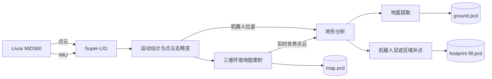

# BOTDOG 三维建图功能说明

## 一、功能概述

BOTDOG Navigation 已具备基于 Livox MID360 激光雷达和 IMU 的三维建图能力。机器人进入未知环境后，可在行走过程中实时计算自身位置、累积环境点云，并同步提取地面信息。建图结束后，系统生成完整的三维环境地图、地面地图和机器人足迹区域补点地图。

该功能不是单纯记录雷达点云，而是完成从传感器原始数据到结构化地图文件的完整处理：

```text
雷达与 IMU 数据
    ↓
机器人运动估计与点云校正
    ↓
三维环境地图构建
    ↓
地面识别与通行区域补全
    ↓
地图文件保存
```

## 二、解决的主要问题

### 1. 解决未知环境没有基础地图的问题

机器人进入仓库、园区、厂房等新环境后，需要建立完整的环境模型。系统通过机器人实际行走完成空间采集，生成包含墙体、立柱、设备、通道和地面结构的三维点云地图。

### 2. 解决机器人移动时点云变形的问题

雷达在机器人运动过程中持续扫描，同一帧点云中的各个点并不是在同一时刻采集。如果直接叠加，容易出现墙面拉伸、重影和结构错位。

系统将 MID360 点云与 IMU 数据进行融合，根据机器人在扫描期间的运动状态对点云进行去畸变，再完成点云配准和地图累积。相比直接拼接原始点云，生成的墙面、边缘和固定结构更加稳定。

### 3. 解决机器人在建图过程中无法确定自身位置的问题

系统采用激光惯性里程计计算机器人在地图坐标系中的位置和姿态，并持续输出运动轨迹。主地图累积、地形分析和足迹补点均使用同一套 `map` 坐标系，保证本轮建图数据位置一致。

### 4. 解决完整点云中地面信息不清晰的问题

完整三维点云同时包含地面、墙体、设备、桌面和其他立体结构，无法单独反映地面的连续性和高度变化。

系统对建图点云进行地形分析，结合局部高度变化和点云分布识别地面，生成独立的地面地图。主地图保留完整空间结构，地面地图单独描述地面范围和高度，两类结果互不混淆。

### 5. 解决机器人底部雷达盲区造成的地面缺口问题

机器人本体会遮挡雷达视线，机器人脚下和紧邻机身的位置容易形成点云空洞。系统根据机器人当前位置及周边地面高度，在 `base_footprint` 附近补充地面点，形成足迹补点地图。

这部分数据用于补足机器人实际经过区域的地面信息，减少机器人附近出现不连续或空洞。

### 6. 解决多节点启动、停止和地图保存不一致的问题

建图涉及雷达驱动、激光惯性里程计、地形分析和地图保存等多个进程。项目已通过统一启动入口组织这些模块，并通过兼容脚本管理配置、运行状态、日志和停止顺序。

停止建图时，系统先保存地面与足迹点云，再触发主地图保存，并等待文件写盘完成。该机制降低了直接结束进程导致地图不完整或主地图未生成的风险。

## 三、整体处理逻辑



整个建图过程分为五个环节。

### 1. 传感器数据采集

Livox 驱动持续发布：

| 数据 | ROS 2 话题 | 用途 |
|---|---|---|
| MID360 点云 | `/livox/lidar` | 提供周围环境的空间结构 |
| MID360 IMU | `/livox/imu` | 提供角速度和加速度，用于运动估计 |

点云和 IMU 使用各自的高频数据队列进入 Super-LIO，由系统完成时间对应和联合处理。

### 2. 机器人状态估计与点云校正

Super-LIO 根据 IMU 预测机器人运动状态，再利用当前雷达点云与局部地图的匹配结果修正位置和姿态。处理过程中会对运动造成的点云畸变进行补偿。

完成计算后，系统持续发布：

- `/lio/odom`：机器人在地图中的实时位置和姿态；
- `/lio/path`：机器人本轮建图的运动轨迹；
- `/lio/cloud_world`：转换到地图坐标系的当前点云；
- `/lio/map_accumulated`：经过降采样的累积地图预览；
- `map -> base_link`：机器人相对地图的坐标变换。

### 3. 三维主地图累积

每帧校正后的点云按照实时位姿转换到 `map` 坐标系，并累积到主地图中。运行期间可以通过 RViz 或测试前端查看地图增长情况、机器人轨迹和局部结构是否对齐。

建图正常结束时，系统对累积点云进行体素降采样并保存为 `map.pcd`。该文件保留本轮采集到的完整三维几何结构。

### 4. 地面提取与足迹补点

地形分析模块同时接收机器人位姿和世界坐标点云，在机器人周围维护地形数据，并根据点云高度分布判断地面与非地面结构。

地面保存过程包含以下处理：

1. 根据地面相对高度筛选地面候选点；
2. 检查局部区域内的高度变化，将明显的墙体和立面排除；
3. 对重复地面点进行空间去重，控制文件规模；
4. 对局部悬空弱层进行过滤，减少桌底等结构被当作地面的情况；
5. 结合 `map -> base_footprint` 位置生成机器人足迹附近的补点。

处理结果通过以下话题实时发布：

| 话题 | 内容 |
|---|---|
| `/terrain_map` | 当前地形分析结果 |
| `/base_footprint_fill_cloud` | 机器人足迹附近的地面补点 |

### 5. 地图保存

主地图和地形地图采用不同的保存方式：

| 地图 | 保存方式 | 原因 |
|---|---|---|
| 三维主地图 | Super-LIO 正常退出时保存 | 需要汇总本轮完整建图点云并统一降采样 |
| 地面地图 | 调用 `/save_terrain_map` 服务保存 | 可在停止前先完成地面分类和过滤 |
| 足迹补点地图 | 随地面地图一并保存 | 保持地面与补点来自同一轮建图过程 |

项目的停止脚本会先调用地形保存服务，再向建图进程发送正常退出信号，并为主地图写盘预留等待时间。只有保存流程结束后，本轮建图结果才完整。

## 四、地图成果

一次正常建图会在场景目录中形成以下文件：

```text
Scene001/
├── map.pcd
├── terrain_map_YYYYMMDD_HHMMSS_ground.pcd
└── terrain_map_YYYYMMDD_HHMMSS_base_footprint_fill.pcd
```

| 成果文件 | 主要内容 | 在建图结果中的作用 |
|---|---|---|
| `map.pcd` | 环境完整三维结构 | 保存墙体、设备、通道和地面等整体空间信息 |
| `*_ground.pcd` | 经过地形分析的地面点云 | 独立保存地面范围和高度变化 |
| `*_base_footprint_fill.pcd` | 机器人实际经过区域的地面补点 | 补足近机身区域的地面空洞 |

地图采用二进制 PCD 格式，兼顾点云读取效率和存储空间。主地图保存完整环境，地面地图保存地面层，足迹补点地图保存机器人附近的补充地面数据。

## 五、运行与管理逻辑

### 1. 统一启动

当前项目提供统一建图入口：

```bash
bash adapters/legacy_scripts/start_mapping.sh /path/to/Scene001
```

启动脚本负责：

- 加载 ROS 2 和 Navigation 工作区环境；
- 生成当前设备使用的 MID360 网络配置；
- 启动雷达驱动、Super-LIO、地形分析和地图保存节点；
- 检查雷达、LIO 初始化和保存服务是否就绪；
- 记录 PID、运行状态和建图日志；
- 建图链路就绪后生成 ready 标记。

### 2. 就绪判断

系统同时满足以下条件后，才将建图状态标记为运行中：

- Livox 驱动已经进入点云发布状态；
- Super-LIO 已完成地图初始化；
- `/save_terrain_map` 服务已经可用；
- 建图 launch 进程仍正常运行。

就绪后会生成：

```text
<scene_dir>/.ground_generation_started
runtime/mapping_status.json
```

ready 表示建图链路已经可用，不代表地图已经采集完成。

启动后的前约 2 秒必须让机器人和雷达保持静止。Super-LIO 会检查 400 个
IMU 样本的均值和波动，只有确认静止后才建立陀螺零偏；如果设备仍在移动，
日志会显示 `waiting for stationary IMU initialization` 并继续等待，不能在此时
开始行走。

### 3. 正常停止

统一停止入口为：

```bash
bash adapters/legacy_scripts/stop_navigation.sh
```

停止过程先冻结 Super-LIO 输入并清空待处理传感器队列，再让 Super-LIO 正常
退出、完成主地图降采样和 `map.pcd` 写盘；主地图确认保存后，才基于冻结时
已经累计的数据保存 terrain、ground 和 footprint 点云，最后关闭其余节点。
脚本设置了保存等待和超时回收机制，既保证正常情况下完成地图保存，也避免
异常进程长期残留。

直接断电或使用 `kill -9` 会绕过 Super-LIO 的保存流程，可能导致本轮没有 `map.pcd`，因此不属于正常停止方式。

## 六、质量控制

### 1. 建图过程可视化

项目提供专用 RViz 配置，可同时查看：

- 当前帧世界点云；
- 累积三维地图；
- 地形分析结果；
- 足迹补点；
- 机器人运动轨迹；
- `map`、`base_link` 和 `base_footprint` 坐标关系。

通过在线观察可以及时发现轨迹跳变、墙面重影、地面分层和点云中断，避免问题一直到建图结束后才暴露。

### 2. 点云规模控制

系统分别对前端匹配点云、地图预览和最终主地图进行体素降采样。匹配分辨率用于平衡实时计算量和建图稳定性；预览分辨率用于降低显示负载；保存分辨率用于控制最终文件规模。

三类分辨率互相独立，不会因为降低 RViz 预览密度而损失最终地图数据。

### 3. 地面数据处理

地面地图保存时执行高度判断、空间去重和局部层过滤。其作用是：

- 排除局部高度变化明显的墙面和障碍结构；
- 减少同一区域重复点，降低文件体积和点云处理压力；
- 抑制部分悬空平面被写入地面地图；
- 保留不同高度层信息，适应一定范围内的坡道和高差环境。

### 4. 保存可靠性

兼容脚本对建图进程采用独立进程组管理。停止时优先使用 `SIGINT` 触发 ROS 2 节点的正常退出逻辑；只有在节点超过等待时间仍未退出时，才使用更强的终止信号进行回收。

运行过程同时记录日志、PID 和状态文件，便于确认本轮地图目录、当前阶段和退出结果。

## 七、当前适用范围

当前建图功能的使用边界如下：

- 主要传感器为 Livox MID360，点云消息类型为 `livox_ros_driver2/msg/CustomMsg`；
- 运行环境为 Jetson ARM64、Ubuntu 22.04、ROS 2 Humble；
- 输出为三维 PCD 地图，不是二维栅格地图；
- 支持接入真实雷达建图，也支持关闭雷达驱动后使用包含 MID360 点云和 IMU 的 ROS 2 bag；
- 主地图依赖 Super-LIO 正常退出完成保存；
- 地形分析能够清理部分动态障碍，但建图质量仍受人员、车辆和移动物体影响；
- 足迹补点依赖正确的 `map -> base_footprint` 坐标变换和周边有效地面观测；
- 当前地形文件使用时间戳命名，同一目录多次保存时可能存在多组结果。
